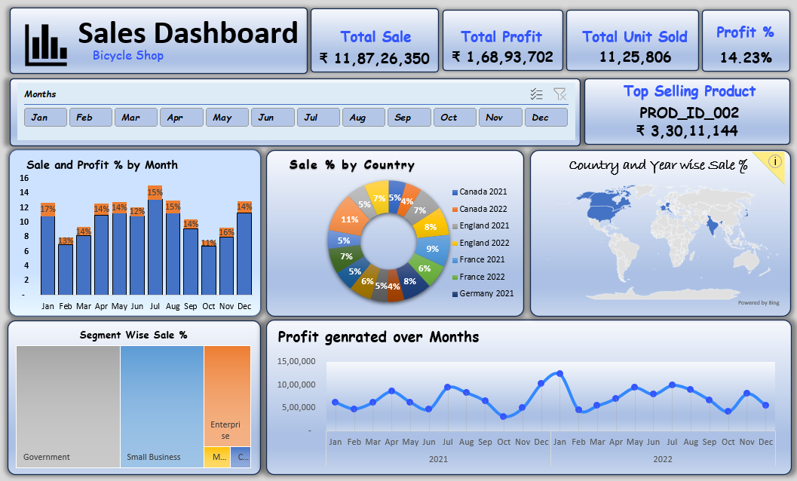

# Sales Dashboard Excel Project

## Overview

This project is an interactive Sales Dashboard created in Microsoft Excel to analyze sales performance, profit trends, product performance, and regional sales distribution.

## Dashboard Features

- KPI Cards
  - Total Sales
  - Total Profit
  - Total Units Sold
  - Profit Percentage

- Interactive Month Slicer

- Sales & Profit % Analysis

- Country-wise Sales Distribution

- Top Selling Product Analysis

- Segment-wise Sales Analysis

- Monthly Profit Trend

- Geographic Sales Visualization using Map Chart

## Tools Used

- Microsoft Excel
- Pivot Tables
- Pivot Charts
- Slicers
- Conditional Formatting
- Map Chart
- Treemap Chart

## Key Insights

- Track monthly sales performance.
- Identify top-selling products.
- Analyze country-wise contribution.
- Monitor profit trends.
- Compare segment performance.

## Files Included

| File | Description |
|--------|------------|
| Sales_Dashboard.xlsx | Interactive Dashboard |
| Sales_Data.xlsx | Raw Dataset |
| sales_dashboard.png | Dashboard Screenshot |

## Dashboard Preview

## Author

Sharad Veer Singh

LinkedIn: https://www.linkedin.com/in/sharad-veer-singh/

GitHub: https://github.com/sharadveersingh
